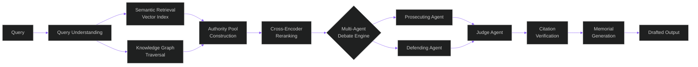
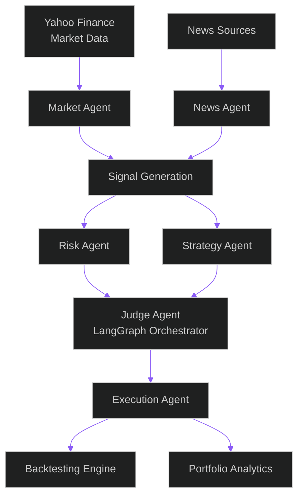
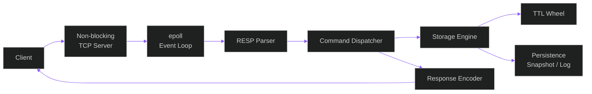
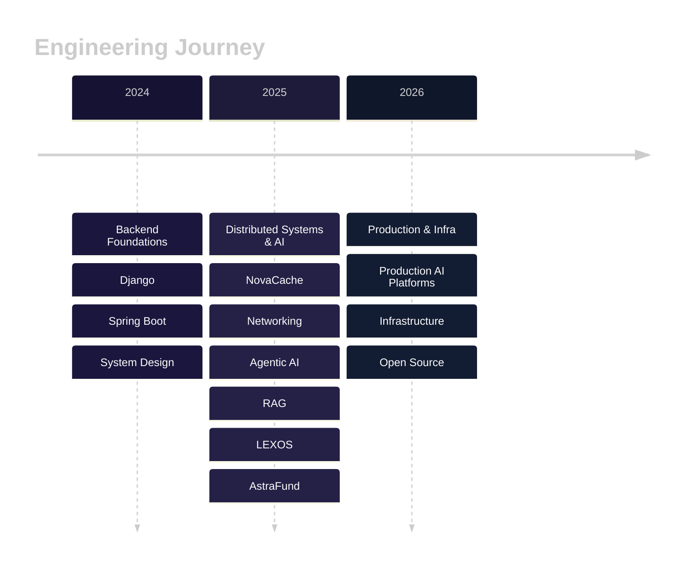

 

  

## &nbsp; About

I work on the parts of software that are hard to get right the first time: retrieval pipelines that need to be *correct*, event loops that need to not drop connections, and agent systems that need to know when to stop talking. Based in India, currently focused on production-grade AI systems, distributed infrastructure, and the backend architecture underneath both.

**Interested in**

<table>
<tr>
<td width="20%" align="center">AI Systems</td>
<td width="20%" align="center">Agentic AI</td>
<td width="20%" align="center">Distributed Systems</td>
<td width="20%" align="center">Backend Engineering</td>
<td width="20%" align="center">Networking</td>
</tr>
<tr>
<td width="20%" align="center">Operating Systems</td>
<td width="20%" align="center">Retrieval-Augmented Generation</td>
<td width="20%" align="center">System Design</td>
<td width="20%" align="center">Databases</td>
<td width="20%" align="center">Developer Infrastructure</td>
</tr>
</table>

## &nbsp; Engineering Dashboard

<table>
<tr><td><b>Current Focus</b></td><td>Production-grade retrieval and multi-agent reasoning for <a href="#-lexos">LEXOS</a></td></tr>
<tr><td><b>Currently Learning</b></td><td>Consensus protocols, storage-engine internals, and large-scale agent orchestration</td></tr>
<tr><td><b>Building</b></td><td>A C++ in-memory data store from raw sockets up — <a href="#-novacache">NovaCache</a></td></tr>
<tr><td><b>Open to Collaborate On</b></td><td>AI infrastructure, RAG systems, and low-level networking/storage projects</td></tr>
<tr><td><b>Latest Interests</b></td><td>Cross-encoder reranking, knowledge graphs for legal reasoning, event-driven architectures</td></tr>
</table>

## &nbsp; Featured Projects

### LEXOS — AI Litigation Intelligence Platform
FLAGSHIP PROJECT &nbsp;·&nbsp; ENTERPRISE-SCALE AI PLATFORM

An end-to-end AI system for legal reasoning: it retrieves authorities, verifies citations against source text, and runs a structured multi-agent debate before producing a drafted memorial — rather than a single-shot LLM answer.

<b>Tech stack &amp; key innovations</b>

 

| | |
|---|---|
| **Retrieval** | Semantic vector search, hybrid dense + sparse retrieval, legal corpus indexing |
| **Reasoning** | Multi-agent debate engine with role-conditioned agents and a judge agent for adjudication |
| **Grounding** | Citation verification layer that checks generated claims against indexed source text |
| **Knowledge** | Domain knowledge graph for statute/precedent relationships, traversed alongside vector retrieval |
| **Reranking** | Cross-encoder reranking over the authority pool before it reaches the debate engine |
| **Output** | Structured memorial generation from verified, reranked evidence |

**Key innovations**
- Two-stage retrieval (semantic + graph) merged into a single authority pool before reranking, instead of relying on vector search alone
- A debate-structured reasoning loop, so conclusions come from adjudicated argument rather than a single forward pass
- Citation verification as a hard gate — claims that can't be traced to source text don't reach the final draft

 

### AstraFund — Multi-Agent Trading Platform
AGENT ORCHESTRATION &nbsp;·&nbsp; LANGGRAPH

A trading research platform where specialized agents own specialized concerns — market state, news sentiment, risk, strategy — and a judge agent resolves their (often conflicting) outputs into a single execution decision.

<b>Tech stack &amp; key innovations</b>

 

| | |
|---|---|
| **Orchestration** | LangGraph-based agent graph with explicit state transitions between agents |
| **Agents** | Market, News, Risk, Strategy, Judge, and Execution agents, each with a narrow, testable responsibility |
| **Data** | Yahoo Finance market data feed |
| **Evaluation** | Backtesting engine and portfolio analytics for measuring strategy performance over historical data |

**Key innovations**
- Risk and Strategy agents run independently and are only reconciled by a dedicated Judge agent — no single agent has unchecked authority over execution
- Signal generation is decoupled from decision-making, so new data sources can plug into the same agent graph

 

### NovaCache — A Redis Clone in Modern C++
SYSTEMS PROGRAMMING &nbsp;·&nbsp; C++ &nbsp;·&nbsp; EPOLL

An in-memory key-value store built from the socket layer up: a non-blocking TCP server on an `epoll` event loop, a hand-written RESP parser, and a storage engine with TTL and persistence — no framework in between.

<b>Tech stack &amp; key innovations</b>

 

| | |
|---|---|
| **Networking** | Custom non-blocking TCP server, `epoll`-based event loop, no external networking library |
| **Protocol** | Hand-written RESP parser compatible with standard Redis clients |
| **Storage** | In-memory storage engine with TTL expiry and thread-safe access |
| **Durability** | Persistence layer for surviving restarts |
| **Concurrency** | Thread-safety across the storage layer under concurrent connections |

**Key innovations**
- Single-threaded event loop for the network layer keeps the RESP protocol handling free of lock contention, while the storage layer is still safe under concurrent access
- TTL expiry implemented without scanning the whole keyspace on every tick

 

<table>
<tr>
<td width="50%" valign="top">

### AuraChat — Secure AI Chat Platform
REAL-TIME &nbsp;·&nbsp; ENCRYPTED

A messaging platform with JWT-based authentication and end-to-end AES encryption, layered with AI-native features: summarization, translation, and sentiment analysis on top of real-time WebSocket messaging.

**Tech stack**
`JWT` `AES-256` `WebSockets` `Real-time messaging` `AI summarization` `Translation` `Sentiment analysis`

</td>
<td width="50%" valign="top">

### CommerceHub — Multi-Vendor Commerce Backend
BACKEND &nbsp;·&nbsp; MARKETPLACE

A backend for a multi-vendor e-commerce marketplace — vendor accounts, catalog and inventory management, and order flows modeled as independent, composable services rather than a single monolithic store.

**Tech stack**
`REST APIs` `Multi-vendor architecture` `Order management` `Inventory` `Auth`

</td>
</tr>
</table>

## &nbsp; Skills

<table>
<tr>
<td valign="top" width="50%">

**AI Systems**

**Backend**

</td>
<td valign="top" width="50%">

**Distributed Systems**

**Databases**

</td>
</tr>
</table>

<b>Full development toolchain</b>

 

## &nbsp; Roadmap

## &nbsp; GitHub Metrics

 

 

<b>Trophy case</b>

 

## &nbsp; Contribution Graph

<picture>
  <source media="(prefers-color-scheme: dark)" srcset="https://raw.githubusercontent.com/sathwiksgjois/sathwiksgjois/output/dist/snake-dark.svg" />
  <source media="(prefers-color-scheme: light)" srcset="https://raw.githubusercontent.com/sathwiksgjois/sathwiksgjois/output/dist/snake-light.svg" />
  
</picture>

## &nbsp; Latest Activity

<!--START_ACTIVITY-->
- Recent public activity refreshes automatically here via `.github/workflows/update-readme.yml`
<!--END_ACTIVITY-->

